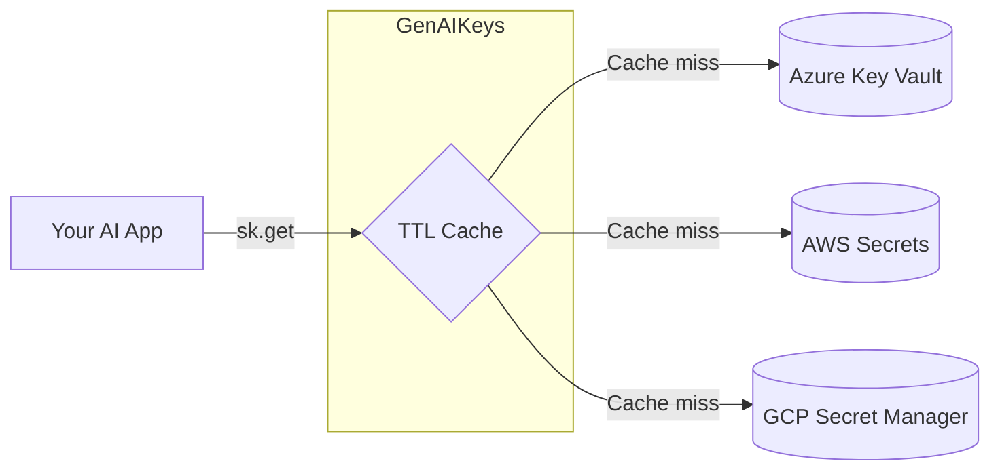

# GenAIKeys

[](https://pypi.org/project/genaikeys/)
[](https://github.com/ndamulelonemakh/genaikeys/actions/workflows/ci.yml)
[](https://opensource.org/licenses/MIT)

> Convenient, extensible API key management for Generative AI applications using cloud secret vaults.
> One Python API across **Azure Key Vault**, **AWS Secrets Manager**, and **Google Secret Manager**.



## Why GenAIKeys?

- **One API, multiple vaults** — swap providers without touching app code.
- **Keyless by default** — Managed Identity, IAM roles, ADC.
- **TTL cache built in** — fewer vault calls, lower bills.
- **Extensible** — bring your own backend in a few lines.
- **Convenience helpers** for OpenAI, Anthropic, and Gemini.

## Install

```bash
pip install genaikeys              # Azure (default)
pip install "genaikeys[aws]"
pip install "genaikeys[gcp]"
pip install "genaikeys[all]"
```

## Quick start

```python
from genaikeys import GenAIKeys

sk = GenAIKeys.azure()                  # or .aws() / .gcp()

api_key       = sk.get("huggingface-api-key")
openai_key    = sk.get_openai_key()     # → "OPENAI-API-KEY"
anthropic_key = sk.get_anthropic_key()  # → "ANTHROPIC-API-KEY"
gemini_key    = sk.get_gemini_key()     # → "GEMINI-API-KEY"
```

Factory methods read defaults from the environment:

| Backend | Env var(s) |
|---|---|
| `GenAIKeys.azure()` | `AZURE_KEY_VAULT_URL` |
| `GenAIKeys.aws()`   | `AWS_DEFAULT_REGION`, optional `AWS_PROFILE` |
| `GenAIKeys.gcp()`   | `GOOGLE_CLOUD_PROJECT` |

> **Azure tip:** Key Vault disallows underscores in secret names. GenAIKeys auto-converts
> `_` → `-`, so `sk.get("OPENAI_API_KEY")` looks up `OPENAI-API-KEY`.

Working examples for each cloud live in [`examples/`](https://github.com/ndamulelonemakh/genaikeys/tree/main/examples).

## Documentation

Full docs are published at **<https://ndamulelonemakh.github.io/genaikeys/>**:

- [Configuration & authentication](https://github.com/ndamulelonemakh/genaikeys/blob/main/docs/configuration.md) — Azure, AWS, GCP setup, credential chains, IAM/RBAC requirements.
- [CLI](https://github.com/ndamulelonemakh/genaikeys/blob/main/docs/cli.md) — populate `.env` files from a vault.
- [Custom backends](https://github.com/ndamulelonemakh/genaikeys/blob/main/docs/custom-backends.md) — implement your own secret store.
- [Logging](https://github.com/ndamulelonemakh/genaikeys/blob/main/docs/logging.md) — enable, disable, route to a custom handler.

## CLI

Populate a `.env` (or `.env.example`) file with values from your vault:

```bash
genaikeys fill .env --keyvault https://my-kv.vault.azure.net
```

Or go the other way — upload values from a `.env` into a vault:

```bash
genaikeys push .env --keyvault https://my-kv.vault.azure.net
```

Only empty values are filled by default; `push` skips keys that already exist. See [docs/cli.md](https://github.com/ndamulelonemakh/genaikeys/blob/main/docs/cli.md) for all options (`--backend`, `--overwrite`, `--dry-run`, `--strict`, `--only`, `--output`, …).

## Caching

```python
sk = GenAIKeys.azure(cache_duration=300)   # 5-minute TTL
sk.clear("OPENAI_API_KEY")                 # invalidate one key
sk.clear()                                 # invalidate everything
```

## Custom backends

```python
from genaikeys import GenAIKeys
from genaikeys.plugins import SecretManagerPlugin

class MyPlugin(SecretManagerPlugin):
    def get_secret(self, secret_name: str) -> str:
        return "my-secret-value"

sk = GenAIKeys(MyPlugin())
```

See [Custom backends](https://github.com/ndamulelonemakh/genaikeys/blob/main/docs/custom-backends.md) for the full interface and entry-point registration.

## Contributing

PRs welcome — see [CONTRIBUTING.md](https://github.com/ndamulelonemakh/genaikeys/blob/main/CONTRIBUTING.md) and [CHANGELOG.md](https://github.com/ndamulelonemakh/genaikeys/blob/main/CHANGELOG.md).

## License

MIT — see [LICENSE](https://github.com/ndamulelonemakh/genaikeys/blob/main/LICENSE).
